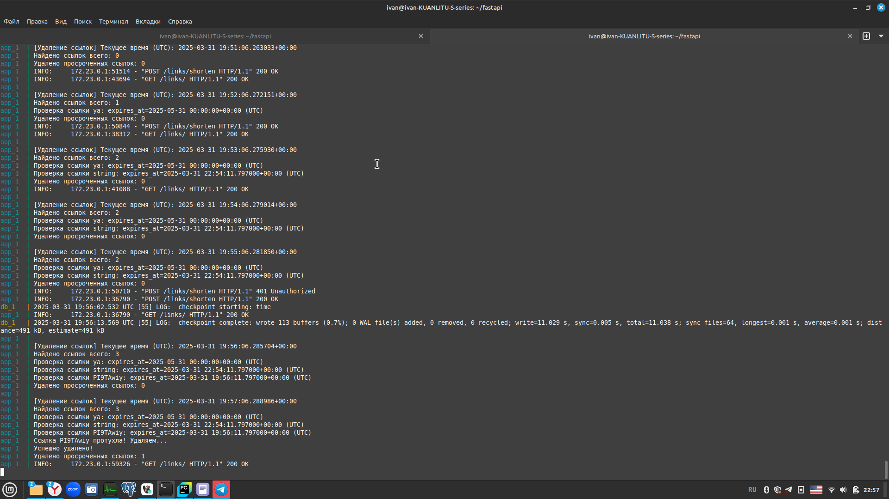

# Описание API.

/auth/register/  - регистрация пользователя

/auth/login/ - авторизация пользователя

/auth/logout/ - оключение авторизации

/auth/me/ - получить данные об авторизованном пользователе

/auth/all_users/ - получить данные обо всех зарегистрированных пользователях (только для админа)

Пользователь отправляет запрос get /links/ - получить все зарегистрированные ссылки, сохранённые в базе данных.

Пользователь отправляет запрос (POST /links/shorten) с длинной ссылкой.
Сервис генерирует уникальный короткий код и возвращает его пользователю.

Указание времени жизни ссылки (опционально):
POST /links/shorten (создается с параметром expires_at в формате даты с точностью до минуты).
После указанного времени короткая ссылка автоматически удаляется.

Указание уникального alias (опционально):
POST /links/shorten создается с параметром alias по желанию пользователя.

Поиск ссылки по оригинальному URL:
GET /links/search?original_url={url}

При открытии короткой ссылки (GET-запрос к /{short_code}) сервис ищет в базе данных соответствующий оригинальный URL и перенаправляет пользователя (Redirect).

DELETE /links/{short_code} – удаляет связь.

Изменение и удаление ссылки доступно только зарегистрированным пользователям.
Авторские ссылки могут изменять или удалять только их авторы.
Ссылки, созданные неавторизованными пользователями, могут быть изменены или удалены любым пользователем.

DELETE /links/{short_code} – удаляет связь.

Изменение и удаление ссылки доступно только зарегистрированным пользователям.
Авторские ссылки могут изменять или удалять только их авторы.
Ссылки, созданные неавторизованными пользователями, могут быть изменены или удалены любым пользователем.

PUT /links/{short_code} – обновляет URL (к короткой ссылке привязывается новая длинная ссылка).

Изменение и удаление ссылки доступно только зарегистрированным пользователям.
Авторские ссылки могут изменять или удалять только их авторы.
Ссылки, созданные неавторизованными пользователями, могут быть изменены или удалены любым пользователем.

Статистика по ссылке:
GET /links/{short_code}/stats
Отображает оригинальный URL, возвращает дату создания, количество переходов, дату последнего использования.

# Примеры запросов.

# Инструкция по запуску.
Локальный деплой:

Сервис запускается командой $docker-compose up --build
Команда выполняется из папки с приложением. 

# Описание БД (при наличии).

